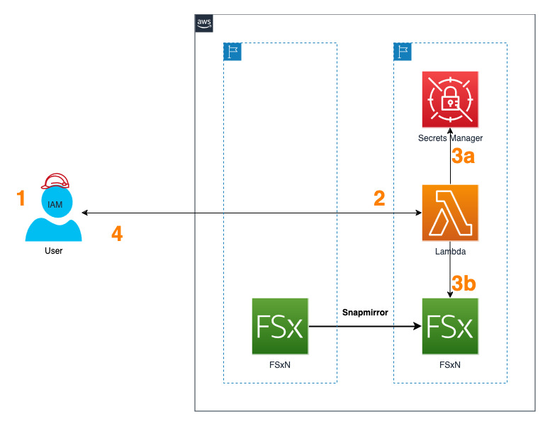

# Snapmirror Status

## Getting started

1. User assumes an IAM Role with permission to execute Lambda function
2. User invokes Lambda function to get output in JSON format
3. Lambda function execution:  
   3a. gets credentials from Secrets Manager for the FSxN  
   3b. requests Snapmirror replication status using the credentials
4. Lambda function processes response from FSxN and reformats response to JSON format

